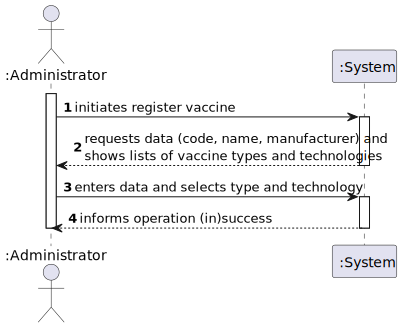
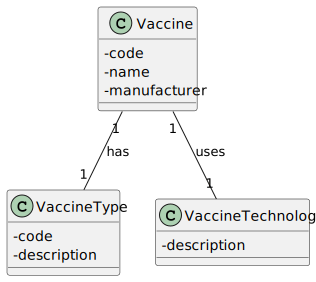
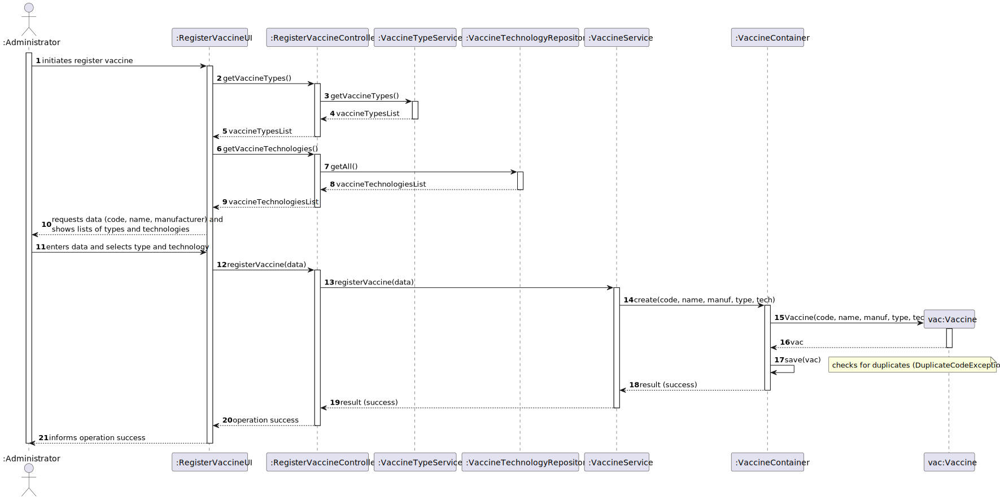
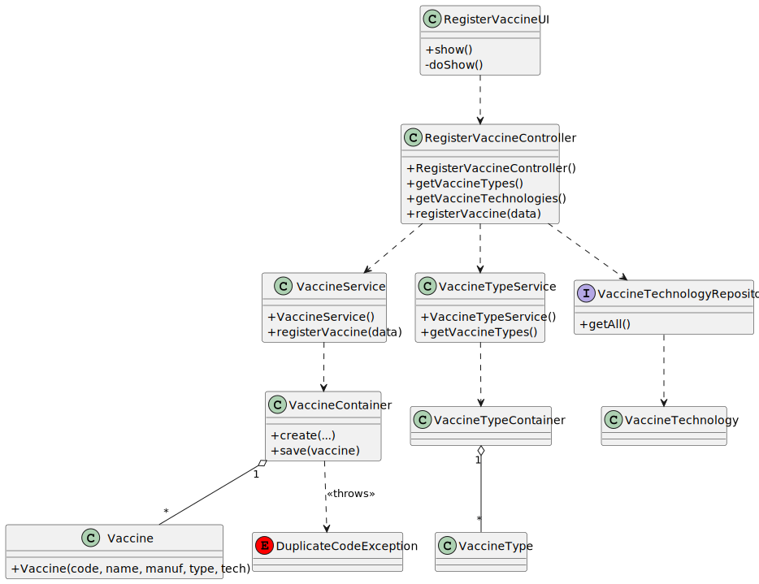

# US 11 - Register a vaccine

## 1. Requirements Engineering

### 1.1. User Story Description

As Administrator, I want to register a vaccine.

### 1.2. Customer Specifications and Clarifications

**From the specifications document:**

> A vaccine is comprehended by a code, a name, a manufacturer, a vaccine type, and a vaccine technology.

**From the client clarifications:**
> **Question:** ?
>
> **Answer:** *

> ### 1.3. Acceptance Criteria

- AC11-1: The vaccine technology must be selected from a predefined list of available types.
- AC11-2: The vaccine type must be selected from a predefined list of available types.
- AC11-3: The vaccine code cannot be empty.
- AC11-4: The vaccine code must be unique.
- AC11-5: The vaccine code must have a maximum of 10 alphanumeric characters.
- AC11-6: The vaccine name cannot be empty.
- AC11-7: The vaccine manufacturer cannot be empty.

### 1.4. Found out Dependencies

- This User Story depends on the realization of:
    - US [XX] - Specify a new vaccine type.
    - US [YY] - Specify a new vaccine technology.
- This US needs to get the existing lists of vaccine types and vaccine technologies to present to the user.

### 1.5 Input and Output Data

**Input Data:**

- Typed data:
    - a vaccine code ("PFI-00001")
    - a vaccine name ("Comirnaty")
    - a vaccine manufacturer ("Pfizer/BioNTech")

- Selected data:
    - a vaccine type (from the predefined list)
    - a vaccine technology (from the predefined list)

**Output Data:**

- (In)success of the operation

### 1.6. System Sequence Diagram (SSD)

## 2. OO Analysis

### 2.1. Relevant Domain Model Excerpt

### 2.2. Other Remarks

- n/a

## 3. Design - User Story Realization

### 3.1. Rationale

| Interaction ID | Question: Which class is responsible for... | Answer | Justification (with patterns) |
|:---------------|:--------------------------------------------------|:-------------------------|:--------------------------------------------------------------------------------------------------------------------------|
| Step 1 | ... interacting with the actor? | RegisterVaccineUI | Pure Fabrication: não há razão para atribuir esta responsabilidade a uma classe do Domínio. |
| | ... coordinating the US? | RegisterVaccineController | Controller (padrão GRASP) |
| Step 2 | ... requesting data (code, name, manufacturer)? | RegisterVaccineUI | IE: é responsável pelas interações com o utilizador. |
| | ... requesting the lists of types/technologies? | RegisterVaccineController | Controller |
| | ... knowing the list of `VaccineType`? | VaccineTypeService | IE: O `VaccineTypeService` encapsula a lógica de negócio e o acesso ao `VaccineTypeContainer`. |
| | ... knowing the list of `VaccineTechnology`? | VaccineTechnologyRepository | IE: O Repositório é responsável por obter as entidades de tecnologia. |
| Step 3 | ... saving the inputted data? | RegisterVaccineUI | IE: é responsável por manter os dados inseridos. |
| Step 4 | ... showing all data and requesting confirmation? | RegisterVaccineUI | IE: é responsável pelas interações com o utilizador. |
| Step 5 | ... instantiating a new vaccine? | VaccineService | Creator (Rule 1) + High Cohesion. O Controller delega a criação no Service, que conhece o `VaccineContainer`. |
| | ... validating all data (local validation)? | Vaccine (constructor) | IE: a própria classe de domínio é responsável por garantir que está num estado válido (ex: campos não vazios). |
| | ... validating all data (global validation)? | VaccineContainer | IE: conhece todas as vacinas, por isso é responsável por verificar duplicados (ex: `DuplicateCodeException`). |
| | ... saving the created vaccine? | VaccineContainer | IE: é o "dono" da coleção de vacinas. |
| Step 6 | ... informing operation success? | RegisterVaccineUI | IE: é responsável pelas interações com o utilizador. |

**Systematization**

According to the taken rationale, the conceptual classes promoted to software classes are:

- Vaccine
- VaccineType
- VaccineTechnology

Other software classes (i.e. Pure Fabrication) identified:

- RegisterVaccineUI
- RegisterVaccineController
- VaccineService
- VaccineTypeService
- VaccineTechnologyRepository
- VaccineContainer

### 3.2. Sequence Diagram (SD)

### 3.3. Class Diagram (CD)

**Note: private methods were omitted.**

## 4. Tests

Três cenários de teste relevantes são destacados abaixo.
(Assumindo que `VaccineFixture` e `VaccineContainerFixture` configuram `VaccineType` e `VaccineTechnology` válidos no `setUp()`).

**Test 1:** Check that it is not possible to create an instance of the Vaccine class with invalid values (local validation).

      TEST_F(VaccineFixture, CreateWithEmptyCode){
          EXPECT_THROW(new Vaccine(L"", L"Comirnaty", L"Pfizer", this->validType, this->validTech), std::invalid_argument);
      }

      TEST_F(VaccineFixture, CreateWithEmptyName){
          EXPECT_THROW(new Vaccine(L"PFI-001", L"", L"Pfizer", this->validType, this->validTech), std::invalid_argument);
      }

**Test 2:** Check that it is possible to create an instance of the Vaccine class with valid values.

      TEST_F(VaccineFixture, CreateWithValidData){
          EXPECT_NO_THROW(new Vaccine(L"PFI-001", L"Comirnaty", L"Pfizer", this->validType, this->validTech));
      }

**Test 3:** Check that it is not possible to add/save a vaccine on the container with a duplicate code (global validation).

      TEST_F(VaccineContainerFixture, FailToSaveWithDuplicateCode){
          shared_ptr<Vaccine> vac1 = this->container->create(L"PFI-001", L"Comirnaty", L"Pfizer", this->validType, this->validTech);
          this->container->save(vac1);

          shared_ptr<Vaccine> vac2 = this->container->create(L"PFI-001", L"Spikevax", L"Moderna", this->validType, this->validTech);

          EXPECT_THROW(this->container->save(vac2), DuplicateCodeException);
      }

## 5. Construction (Implementation)

- n/a

## 6. Integration and Demo

A menu option on the console application (e.g., in `AdministratorMenuView`) was added. Such option invokes the `RegisterVaccineUI`.

      int AdministratorMenuView::processMenuOption(int option) {
          int result = 0;
          BaseView * view;
          switch (option) {
          
            case 1: 
              view = new RegisterVaccineUI(this->userToken);
              view->show();
              break;
            ...
          }
          return result;
      }

## 7. Observations

- n/a